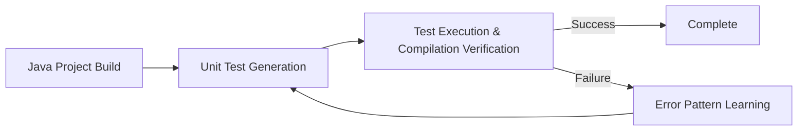
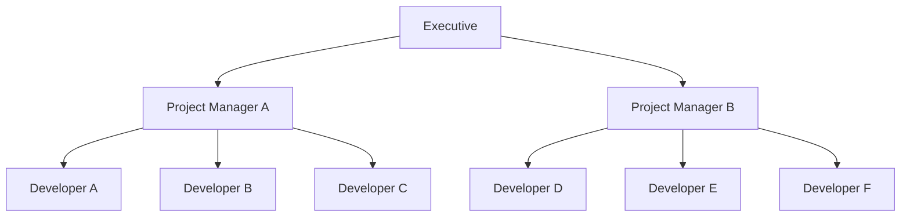
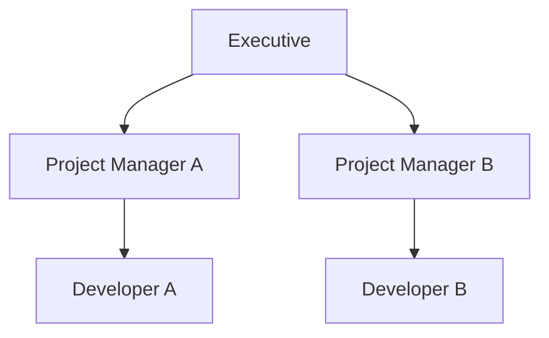
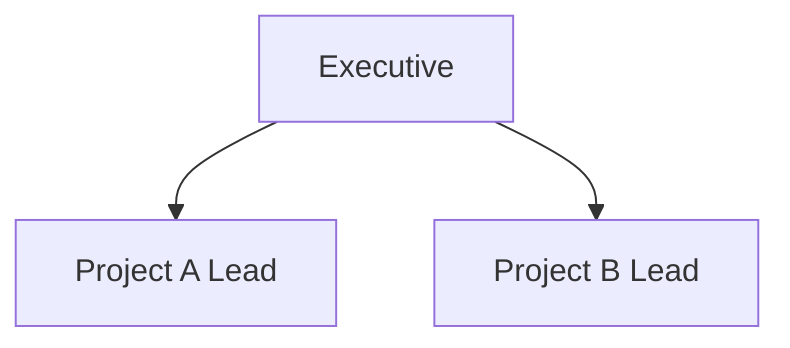

## Introduction

I've been working in the IT industry for nearly nine years now. Lately, I find myself increasingly thinking that traditional software development is finally coming to an end.

Having been exposed to computers from a young age, I entered the IT industry and have witnessed the evolution of various technologies throughout my career. However, I believe this current evolution is qualitatively different from previous technological advances—it's an evolution that will transform the very structure of the industry itself. This isn't just about AI dramatically improving software development productivity; I believe we need to fundamentally reconsider traditional development methodologies and the very value that software developers provide.

Compared to last year or the year before when AI adoption was just beginning to spread, this year I've noticed more people using AI. The fact that major media outlets have started covering the provocative topic of "AI-induced unemployment" seems to have made it more acceptable than it was last year.

"AI-induced unemployment" is already becoming a reality in the United States. Japan will be no exception, and I'm certain that when considering longer time spans of around 10 years, so-called white-collar occupations will experience significant reduction.

In fact, according to research from the Federal Reserve Bank of St. Louis in August 2025, significant increases in unemployment rates have been confirmed in occupations with high AI exposure (particularly computer and mathematics fields). Additionally, Goldman Sachs estimated in their August 2025 report that AI could potentially replace 6-7% of the U.S. workforce.[^1]

Today, I'd like to share my personal thoughts on such "AI-driven societal changes."

## It's Time to Rethink the Software Development Industry

I personally began utilizing AI technology called LLM (Large Language Model) two years ago, and have been using it particularly prominently last year and this year. As an indication of the scale of my AI usage, last month alone I spent $125 on AI tools—a figure that reflects the growing costs associated with professional AI-assisted development.

Even just in the context of software development, I began incorporating AI-generated code since last year, and this year, while I've changed various tools, I'm basically having AI write code. This year, I've been involved in 1,200 code updates on my personal GitHub account, with fewer than 100 cases where I wrote code myself—demonstrating how AI has fundamentally shifted my role from code writer to code reviewer and orchestrator.

For me, writing code myself has already become a thing of the past, and recently my main work has become dialoguing with AI to generate code and reviewing and providing feedback on the quality of the output.

In traditional software development before AI adoption, knowledge specific to programming languages and libraries was important. For example, "JavaScript's Date type has various problems, so it's better to use libraries like date-fns."

However, since I started using AI, I feel that the premise of needing knowledge is beginning to crumble. While current AI isn't perfect, it knows how to write code, and through in-context learning—a technique that allows AI to adapt to new tasks by analyzing examples and contextual information provided within the conversation, without requiring additional training. Using this approach, we can have it learn project-specific and library-specific information.

In other words, intellectual work that previously required knowledge can now be performed to some degree with minimal knowledge.

### AI's Limitations and Possibilities

I need to mention this: current AI technology is neither perfect nor omnipotent.

AI-generated code sometimes doesn't work. It can generate redundant and unnecessary code, throwing projects into chaos (speaking from experience). There are even services dedicated to fixing problematic code generated by AI.

VibeCodeFixers.com is a real service that specializes in fixing problematic code generated through AI-powered "Vibe Coding." According to founder Swatantra Sohni, over 300 veteran developers have already registered, and they've matched 30-40 projects so far.[^2]

However, we need to understand that these problems exist because AI is in a transitional phase.

Currently, successfully utilizing AI requires skillfully sharing tacit knowledge and contextual information necessary for work with the AI, and whether you understand the knack of using AI or not greatly affects the quality of AI-generated output. I personally think this difficulty is what's causing divided opinions about AI.

Additionally, at present, many people simply don't know enough about the tools available for utilizing AI. For example, some free tools like the GitHub Copilot VS Code plugin aren't sufficiently optimized compared to paid tools provided by companies developing AI models, so it's understandable when people who only know these tools complain about AI.

AI utilization has just begun, and both usage methods and tools are progressing day by day. In fact, the tools I was using in the first half of this year (like Cursor) have been replaced by other tools (Claude Code (an AI coding assistant that runs in the terminal) and Codex CLI (a similar tool from OpenAI)) at present, and I'm currently experimenting with new utilization methods.

Current limitations are temporary in the process of technological development and are likely to be resolved through technological maturation and tool improvements. What's important is that this progress in AI utilization will continue.

## Real-World Examples of AI Implementation in Large-Scale Projects

How far is AI-driven workforce reduction actually possible? People who already use AI daily probably know from experience that they can achieve several times the productivity just through AI utilization. In the field of software development, various tools like GitHub Copilot (Microsoft's AI code completion tool), Cursor (AI-integrated code editor), Claude Code (AI coding assistant that runs in the terminal), and Codex CLI (OpenAI's similar tool) are popular, so many people are probably improving their work efficiency with these interactive tools. But is it possible to achieve even higher productivity?

Over the past few months, I've been involved in an experimental project for utilizing AI in software development for a certain large corporation. I won't go into details, but the project's code reached several gigabytes in scale—a project so large that just compiling the code required considerable time.

In software development processes, it's common to write unit tests (test code) to ensure that code actually works. In a multi-gigabyte large-scale project, even small code changes can have unexpected side effects, making unit tests almost essential, yet unit test maintenance hadn't kept up in this particular project. My task was to try large-scale AI generation of unit tests in such a project.

The total number of unit test files that needed to be generated reached tens of thousands. When we estimated human work, it would take over a year even if each file took less than 30 minutes. Even with AI assistance, if each took less than 10 minutes, it would still require over six months. In other words, we needed to have AI generate code in batches, fully automatically.

In this context, I employed a method of creating a unit test generation workflow using LangGraph (an AI workflow construction framework). LangGraph is a framework for building AI workflows that enables AI agents to automatically execute complex, multi-step processes with built-in error checking and iterative refinement capabilities. For example, it makes it easy to check the quality of AI-generated output within a workflow and have AI regenerate if there are quality issues. In this case, I created a workflow to have AI generate actually functional unit tests and adopted an approach where AI would automatically generate unit tests even while humans were sleeping or resting. The following diagram shows the flow of automatic test generation by AI:

To state the results: while there were some issues with unit test coverage, we were able to realize having AI automatically generate functional unit tests. I tried various approaches referencing literature from arXiv.org (an academic platform where researchers publish papers), but I'll omit the details.

What's important is that currently prevalent AI utilization methods are still relatively superficial, with many advanced techniques and applications remaining unutilized or under-researched. Research in AI utilization will continue to advance, and better methods are highly likely to emerge.

## Changes in Organizational Structure and the Reality of Workforce Reduction

This is a change I've felt experientially since this year: with improved productivity through AI technology advancement, projects that previously required three people, for example, can now be adequately handled by one person. Furthermore, I even think it's faster and easier to have AI manage project information and progress rather than sharing it among three people.

In other words, AI is making workforce reduction possible.

Traditional software development organizations generally take the following form:

Project managers allocate development tasks to their respective team members.

I believe it wouldn't be surprising if next year we see organizational structures like the following:

To be frank, I believe AI performance has already reached a level where workforce reduction is feasible—to the extent of having individuals handle triple their previous workload—as of this year. (However, in Japan's case, due to the tendency to prioritize precedent and avoid risks, what I've observed is more people becoming underutilized rather than actual workforce reduction taking place.)

In the future, I believe workforce reduction could progress to the following organizational structure:

When workforce reduction progresses to this level, developers will need to evolve from "task executors" into "business stakeholders," and it's evident that they'll require fundamentally different skill sets than those valued today.

Of course, this scale of workforce reduction isn't immediately feasible, and alternative structures may emerge for reasons such as avoiding over-dependence on individual contributors. However, I believe it's undeniable that AI is enabling workforce reduction, starting from the junior levels within the IT industry.

On the other hand, the demand for IT specialists to drive digital transformation—currently popular in Japan and precisely the industry I belong to—seems likely to persist for some time. Particularly now, many companies are eager to begin utilizing AI, and AI won't eliminate the fundamental demand for IT and digitalization initiatives.

However, even with sustained demand, workforce reduction remains possible. While the overall market may remain substantial, it wouldn't be surprising if we see a future where this value is more efficiently captured by fewer professionals. Even in domains that previously required large teams, I believe the justifications for engaging external personnel will continue to diminish.

## What Value Remains for Software Developers?

While AI is tremendously increasing productivity in all kinds of intellectual labor including data analysis, coding, and document creation, I think workforce reduction in digital spaces will progress day by day. AI-driven workforce reduction in white-collar occupations has already begun in America, and I think it will spread to Japan. Recently, I had an opportunity to speak with an IT industry recruiter who previously helped me, and they mentioned that even in Japan, where AI adoption hasn't sufficiently progressed, things will have changed within two years.

In university, I learned about Giddens' theory of "reflexive modernity." This is a sociological theory that explains how technological development and the spread of rational thinking due to modernization make traditional values meaningless, causing society itself to reflexively examine and change itself.[^3] Right now, I believe we're at a time when we need to reflexively reconsider our relationship with IT technology due to the technological development of AI.

What I've been thinking lately is that at the end of exponential technological development in digital spaces, all that remains for humans is "the will to realize something." Current AI doesn't yet have "will"—they need instructions and commands from humans. In other words, as digital tasks become increasingly automated, the remaining human value may center on the strategic intent to 'provide useful services' or 'solve social problems.' Workers whose primary function is executing these intentions, rather than formulating them, may find their roles diminished in an AI-enhanced environment.

## Entrepreneurship as an Option

While reflexively considering my relationship with IT and my career in this way, I'm considering "entrepreneurship" as one option. This is because entrepreneurship is the fastest way to generate one's own "will." Fortunately, in digital spaces, AI support has made the cost of realizing something in unknown fields smaller than before.

We should think about how to live when that happens. Frankly, I don't clearly know what the future world will look like. I don't think anyone clearly knows about the future. However, in a society that's changing due to AI, I feel it's important to think reflexively.

---

[^1]: [Federal Reserve Bank of St. Louis (August 2025) "Is AI Contributing to Rising Unemployment? Evidence from Occupational Variation"](https://www.stlouisfed.org/on-the-economy/2025/aug/is-ai-contributing-unemployment-evidence-occupational-variation), [Goldman Sachs (August 2025) "How Will AI Affect the Global Workforce?"](https://www.goldmansachs.com/insights/articles/how-will-ai-affect-the-global-workforce)

[^2]: [404 Media (September 2025) "The Software Engineers Paid to Fix Vibe Coded Messes"](https://www.404media.co/the-software-engineers-paid-to-fix-vibe-coded-messes/), [Futurism (September 2025) "Amateurs Using AI to 'Vibe Code' Are Now Begging Real Programmers to Fix Their Botched Software"](https://futurism.com/vibe-code-real-programmers-fix-software)

[^3]: Anthony Giddens, "The Consequences of Modernity" (1990)
