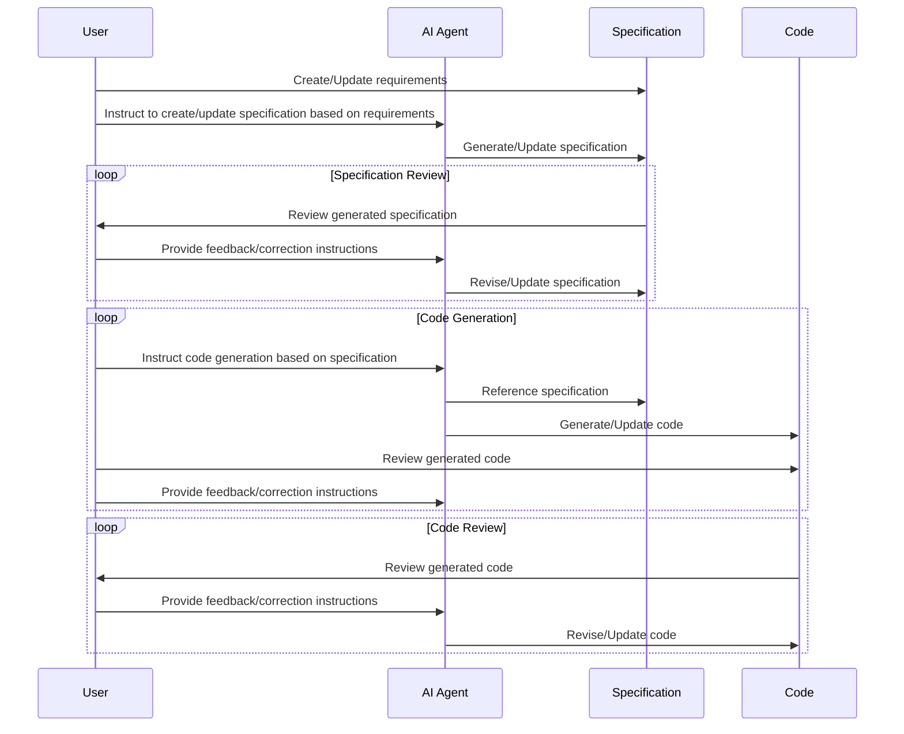

## Introduction

Before I knew it, 2025 is already coming to an end.

This year saw rapid advancement in AI agents, and AI-driven development methodologies in software development have evolved significantly. The last time I wrote a similar article was in May 2025, but the landscape has changed dramatically in the months since then.

The most significant turning point was the emergence of Claude Code. With AI agents now able to handle everything end-to-end, the act of actually writing code in software development is becoming almost unnecessary.

However, new challenges in AI-driven development have emerged alongside these advances. While solutions are being explored through trial and error across various fields, I wanted to document my thoughts on AI-driven development practices and challenges as of December 2025.

## My Current Situation

Since last year, I've been increasingly relying on AI for the actual act of writing code. Let me summarize the evolution of my tooling and current setup.

First, as of January 2025: Developer tools were still limited, and MCP had just been released. At that point, I was primarily using Cursor, and when Cursor hit its limits, I would switch to Claude Desktop + [Filesystem MCP](https://github.com/modelcontextprotocol/servers/tree/main/src/filesystem). I was also using GitHub Copilot, but both in terms of performance and UX, I didn't find it compelling enough to use as more than a supplementary tool. I tried other AI development tools like Devin AI, but ultimately kept using Cursor as my main tool.

Then in May, Claude Code was released, and the situation changed dramatically. AI agents could now complete development work without needing an IDE. By July 2025, I cancelled my Cursor subscription and started paying $100/month to Anthropic for Claude Code. (Another reason for cancelling Cursor was that it frequently hit token limits.)

In August, GPT-5 was released, and I started using it in combination with Codex CLI. I was impressed by the performance improvements and used the GPT-5 + Codex CLI combination for a while. Additionally, with the release of Gemini 3 Pro, I increased my usage of Gemini CLI as well. Both are excellent AI models, and I felt the commoditization really taking hold.

However, I've ultimately settled on Claude Code for now. Claude Code is stable, and its ecosystem with features like [sub-agents](https://code.claude.com/docs/en/sub-agents) and [hooks](https://code.claude.com/docs/en/hooks) is well-developed, so I don't currently see a compelling reason to switch to other tools.

## Challenges in AI-Driven Development

### Context Loss

AI agents fundamentally operate based on short-term context. This means they can generate code without understanding the big picture of a long-term project or the design intent.

An actual example I experienced: In a certain web app that wasn't supposed to require authentication, the AI agent implemented authentication features anyway. The AI agent probably added authentication out of security considerations, but it implemented unnecessary features because it didn't understand the overall design intent of the project.

### The Risk of Frankenstein Code

Similar to the "context loss" problem, there's also the risk of Frankenstein code. When code generated by multiple AI agents is combined, if each agent adopts different styles or architectures, overall consistency and quality can deteriorate.

For example, in frontend development using React, there are multiple known approaches to state management: Redux, Recoil, Context API, Zustand, and others. If AI agents generate code using different approaches, the codebase loses consistency and becomes difficult to maintain.

In fact, in one of my projects, part of the AI-generated code used Redux while another part used Context API.

### The "You Don't Know What You Don't Know" Problem

This problem is more likely to affect non-engineer users who have started writing code with AI than software engineers like myself, but I've had similar experiences too. Especially when delegating design to AI agents in areas where I have less experience, it's often difficult to judge whether the design generated by the AI agent is truly optimal.

For example, even in frontend development using React, there are various choices: "Should we use server-side rendering?" "Should we use static site generation?" "Should we use client-side rendering?" To choose the optimal option, you need to understand the project requirements, but if you leave everything to the AI agent, there's a risk of missing the optimal choice.

Additionally, if the person using AI lacks technical knowledge, they may not notice problems in the design generated by the AI agent. This is exactly the "you don't know what you don't know" situation.

## "Spec-Driven Development"

Since around this summer, I've been hearing a phrase more frequently: "Spec-Driven Development." As mentioned earlier, it's a challenging problem to properly provide long-term context to AI agents. My understanding is that development teams adopting AI-driven development are gradually adopting the "Spec-Driven Development" methodology to address this.

Since August of this year, I've been experimenting with "how to provide medium to long-term context to AI agents?" Sometimes I left everything to AI and ended up with Frankenstein code, but I ultimately found stability with the "Spec-Driven Development" approach.

Tools like GitHub's [Spec Kit](https://github.com/github/spec-kit), [Kiro](https://github.com/kirodotdev/Kiro), and in Japan, [cc-sdd](https://github.com/gotalab/cc-sdd) are well-known. The methodology involves maintaining documentation as specifications and instructing AI agents to generate code based on those specifications. Approaches like [PRP (Product Requirement Prompts)](https://github.com/Wirasm/PRPs-agentic-eng) follow a similar philosophy.

After trying various approaches, I use my own specification templates, agents, and commands based on [ai-coding-project-boilerplate](https://github.com/shinpr/ai-coding-project-boilerplate). I'll skip the detailed parts as they're still in the trial-and-error phase, but basically all frameworks are doing similar things.



The basic idea of "Spec-Driven Development" is that by explicitly providing long-term context as documentation that AI agents can reference, they can generate code without losing that long-term context.

## Benefits I've Felt from Adopting "Spec-Driven Development"

The following are the benefits of "Spec-Driven Development" that I've personally experienced.

### Benefits for Humans, Not Just AI

As I mentioned in [another article this year](/en/blog/legacy-system-migration-lessons), having specifications versus not having them makes a huge difference in terms of peace of mind for humans. In the worst case, you can have AI agents read the code to understand the specifications, but for humans, having documentation that explains the development history and design intent provides tremendous reassurance. It also helps avoid the absurd situation where development speed drops due to encountering code with unclear intent that you're not sure whether you can modify.

Additionally, when new members join a team development project, or when existing members have been away from the project for an extended period, having specifications makes it easier to grasp the overall picture of the project. They can smoothly participate in development without wasting time.

I think Spec-Driven Development has reaffirmed the importance of documentation. Previously, specifications were often created after development was finished or just before release, but with Spec-Driven Development, you need to create and continuously update specifications from the early stages of development, so motivation for documentation maintenance is naturally sustained.

### Easier to Provide Context to AI When Bugs Occur

Bugs are inevitable in software development, and they occur quite frequently even when delegating to AI agents.

However, "where did the bug occur?" and "what was the design intent behind that code?" were previously difficult things to convey to AI agents. It's quite challenging to trace through code history with AI and say, "This code was written with this intent, but this bug has occurred. The original intent was this, so please fix it."

Before adopting Spec-Driven Development, when I asked an AI agent to fix a bug, sometimes the implemented functionality would disappear along with the bug fix. However, when using Spec-Driven Development, you can more easily provide context to AI agents by referencing the specifications.

For example, when requesting a bug fix using Claude Code + Spec-Driven Development, you can instruct as follows:

```sh
@docs/done/2025-12-15-refactor-map-reduce.md There's a bug in the Map-Reduce feature implemented in this spec. Specifically, the reduce function isn't working correctly. Please reference the relevant section of the specification and fix the bug. Be careful to maintain consistency across the entire codebase according to the design documents and specification intent.
```

Recently, I've been able to complete almost all development work using just Claude Code's command features, making it even more efficient to request bug fixes.

```sh
/dev:fix-bug @docs/done/2025-12-15-refactor-map-reduce.md The Map-Reduce feature isn't working.
```

### Easier to Understand the Situation

Even as we enter an era where AI agents develop code, since we're in a transitional period, there are still many opportunities to share daily tasks and project progress. For daily meetings, you can just quickly update yesterday's notes, but for monthly meetings, writing out the entire project's progress each time is quite tedious.

Spec-Driven Development is helpful in such situations too. Just by giving Claude a quick instruction, it can generate weekly or monthly progress reports.

```sh
Please create a project progress report from December 3rd to December 17th.
The purpose is to understand the situation for project management.
Please reference the tasks completed during the relevant period in the `docs/done` folder, and include the summary and completion status of each task.
Group similar tasks together to make overall progress easier to understand.
```

## Challenges of "Spec-Driven Development"

From here, I'll discuss the challenges I've felt after adopting "Spec-Driven Development." These are more about operational difficulties rather than disadvantages.

### Increased Load in the Design Phase

As the name suggests, in "Spec-Driven Development," the "specification" is the most important element. If the quality of the "specification" is poor, not only the code generated by AI agents but the quality of the entire project will decline.

Furthermore, as mentioned earlier, the "you don't know what you don't know" problem also exists when creating specifications. In other words, even when delegating design to AI agents, a certain level of knowledge and verification is necessary to judge whether the design generated by the AI agent is truly optimal.

It's not uncommon to spend an entire day just on documentation, and while project management and quality have improved with the adoption of "Spec-Driven Development," I feel that productivity has decreased. If regression (rework) has decreased, then it's a net positive, but the fact that the adoption of AI agents has increased the burden on humans is a challenge, and I think there's room for further efficiency improvements.

### Maintenance Cost of Specifications

This is similar to the increased load in the design phase, but the maintenance cost to keep specifications up to date is also not negligible. If specifications become outdated, there's a risk that AI agents will generate code based on incorrect context.

Additionally, the types and formats of documentation are important, and you need to think about how much content should be included in specifications and in what format. Should design documents contain just requirements and implementation details? Is a format like Architecture Decision Records (ADR) also needed? Should specifications include detailed parts? There's a lot to consider.

The effort required to manage documentation has inevitably increased, so I'm exploring ways to improve efficiency. By the way, [you can automate specification maintenance to some extent using Claude Code's hook feature](https://zenn.dev/appbrew/articles/e2f38677f6a0ce) (though not everything can be automated...).

## Conclusion

2025 saw rapid advancement in AI adoption, and discussions about "AI taking away white-collar jobs" became prevalent. I also found myself thinking about similar things more often. However, as I deal daily with challenges stemming from LLMs' short-term context and hallucination problems, I feel that humans may need to remain involved to some degree after all.

Until around this fall, I was thinking, "Maybe we should just leave everything to AI?" But now I increasingly feel that it's important to balance the parts delegated to AI agents with the parts where humans remain involved. Specifically, design and requirements definition should be led by humans with AI assistance, while repetitive tasks like code generation, testing, and documentation should be delegated to AI agents.

After all, since we're in a transitional period, the future is uncertain, but for now, I want to enjoy the daily progress while continuing to work on solving the challenges of AI-driven development.
