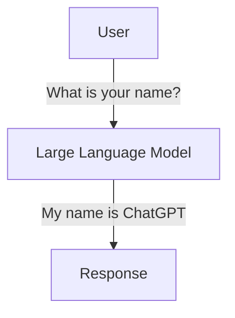
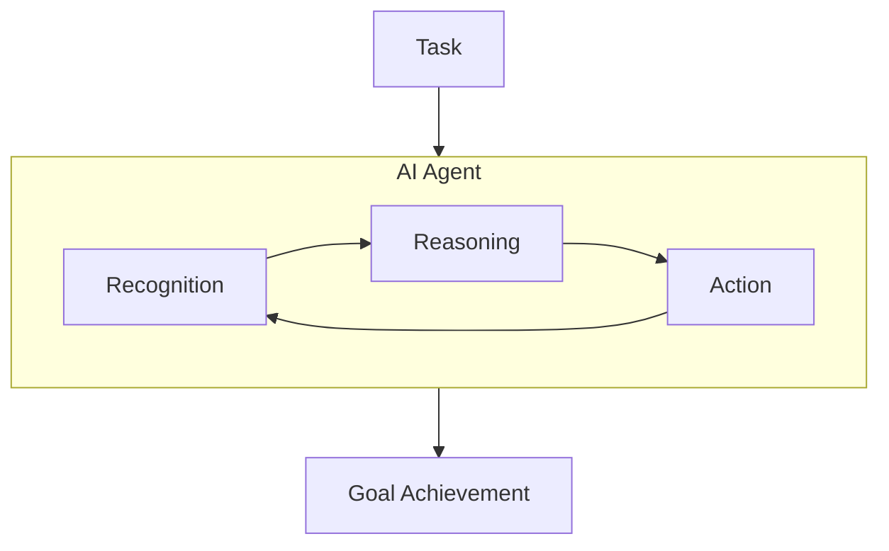
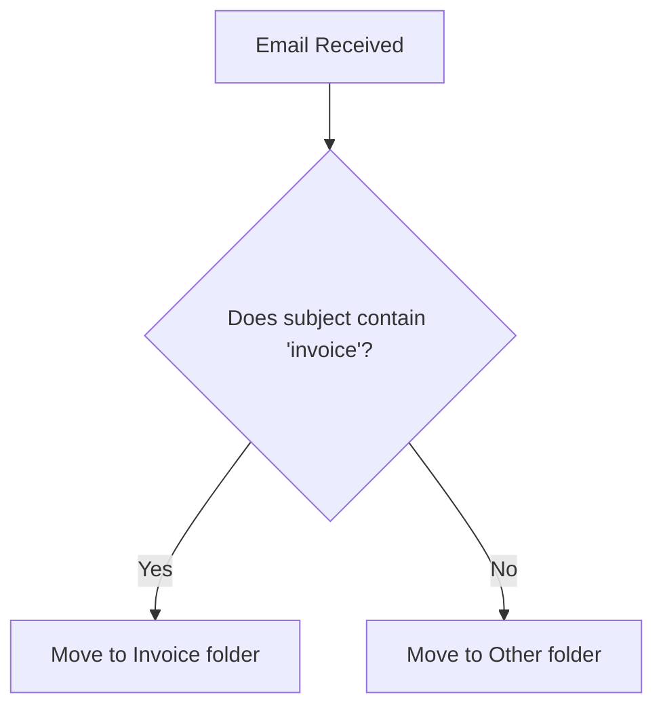
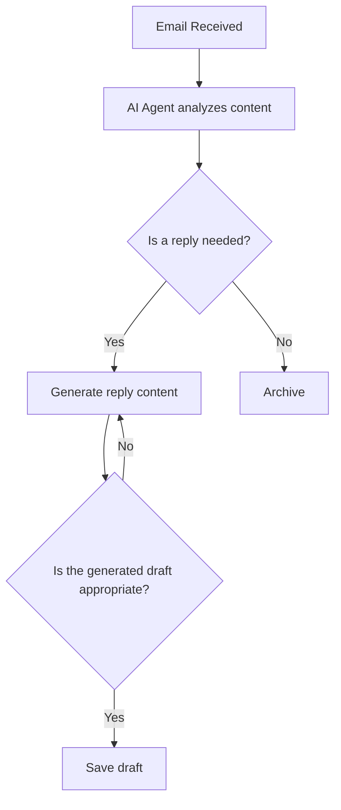

Happy New Year 2026!

2025 was a year when large language models (LLMs) saw dramatic performance improvements, and AI agents began to be deployed in many fields.
I noticed that many people around me who had never used AI before started using it. Perhaps you've also seen AI being used more frequently in your workplace and daily life.

My work as a software engineer has also been changing. More than half of my working hours last year were spent designing and implementing AI agents, as well as conducting proof-of-concept (PoC) projects for AI agents and AI agent workflows.
In this context, I've been finding it increasingly difficult to answer when people ask "What do you do?" during New Year greetings. In the past, I could simply say "I'm developing systems for Company X" or "I'm building an app for Company Y," and most people would understand. But when I explain "I'm designing AI agent workflows," it's not so easy for people to grasp.

So in this article, I'd like to explain what AI agent workflows are, while also organizing my own thoughts on the topic.

## A Note on Terminology

Before diving into the main topic, let me briefly clarify some terminology.

Several terms are used in the industry to refer to workflows that leverage AI agents:

- **Agentic Workflow**: An expression using the adjective "agentic," referring to workflows that leverage the autonomy of AI agents. This term is frequently used by AI researchers and companies like Andrew Ng and Anthropic.
- **AI Workflow**: Refers to workflows that utilize AI in general, but since it also includes those that follow predefined fixed procedures, it's a broader concept.
- **Agent Workflow**: Refers to workflows that incorporate AI agents, but since "AI" is omitted, it can be ambiguous depending on the context.

While these terms have subtle nuanced differences, they are often used interchangeably in practice. In this article, I'll use the term "**AI Agent Workflow**" consistently to mean "autonomous workflows that leverage AI agents."

## What is an AI Agent?

As a first step, let me briefly explain what AI agents are.

These days, large language models (LLMs) and AI agents tend to be conflated, but they are different concepts.

A large language model (LLM) is a "model" that processes information, like a brain. It has learned from massive amounts of text data and has the ability to generate the most appropriate output for a given input. While it's essentially just statistically selecting the next word from big data, advances in models have made it possible to generate responses so natural that it feels like conversing with a human.
For example, it can generate continuations of text or answer questions.

On the other hand, an AI agent is a "system" that uses LLMs to autonomously perform specific tasks. AI agents receive instructions from users and can perform complex operations such as goal recognition, reasoning, information gathering, and action based on those instructions.

For example, coding agents like Claude Code can receive requirements from users, research implementation best practices, generate code, run tests, and make corrections as needed. AI agents manage the entire process until task completion, not just response generation.

## What is an AI Agent Workflow?

Next, let me explain AI agent workflows.

In our increasingly digital society, many routine tasks have already been automated even without AI. For example, automatic email sorting or automatic invoice generation can be automated by setting up rules in advance.

Many such routine tasks can be automated without AI, using traditional rule-based systems or RPA (Robotic Process Automation) workflows.
The reason is that most routine tasks can be processed based on clear rules or conditions. For example, extracting specific keywords from emails or processing data in a fixed format can be adequately handled with rule-based approaches.
In software development, testing and deployment automation are also automated through CI/CD workflows following predetermined procedures.

However, non-routine tasks or those requiring complex decision-making can be difficult to handle with traditional rule-based automation. This is where AI agents come in. AI agent workflows are mechanisms that enable AI agents to automatically perform non-routine tasks on behalf of humans.
For example, an AI agent can "analyze email content and save an appropriate draft reply" - automating tasks that previously couldn't be handled mechanically.

While I used "email handling" as an example here, AI agent workflows can be applied to various fields including data analysis, report creation, and customer support.

## Wait, Isn't an AI Agent Alone Sufficient?

After reading this far, some might think "If we have an AI agent, do we really need a workflow?"
Indeed, for single tasks like "email handling," an AI agent alone might be sufficient.

However, in actual business operations, multiple tasks often work in conjunction, and a single AI agent may not be able to handle everything.
Also, many business operations require handling large datasets, which can be difficult for a single AI agent to process due to maximum token limits.
There may also be cases where you need to respond to various triggers (email reception, scheduled execution, manual triggering, etc.).

Therefore, by using AI agent workflows, it becomes possible to automate more complex and flexible business processes by combining multiple AI agents with traditional systems.

## What Operations and Controls Are Possible with AI Agent Workflows?

First, you can assume that all the operations and controls possible with traditional routine workflows are also possible with AI agent workflows.
You can trigger a workflow on email reception like "automatic email sorting," you can collect data periodically, and you can start workflows manually.

Regarding controls, many things are possible, but here are some representative ones:

- **Sequential Execution**: Execute tasks in order. For example, executing data collection, analysis, and report creation steps in sequence.
- **Conditional Branching**: Select different paths based on task results. For example, sending an alert only if analysis results exceed a certain threshold.
- **Loop**: Repeat a task until a specific condition is met. For example, repeatedly collecting data until collection is complete.
- **Parallel Execution**: Execute multiple tasks simultaneously. For example, analyzing multiple datasets at the same time.

These controls can be implemented without AI agents using conditions like "does it contain a specific string?" or "does the value exceed the threshold?" You can also use multiple AI agents for control, such as "having another AI agent evaluate whether content generated by one AI agent is appropriate."

Human-in-the-Loop can also be incorporated into workflows. For example, having a human perform final confirmation when financial decisions are involved.

Since you're using AI agents, if there are tools or APIs that AI agents can use, you can incorporate them into the workflow. For example, you can have AI agents perform web searches or retrieve information from external databases.

Therefore, as long as you have data and decision criteria, you can build flexible and complex workflows for various fields - technically speaking.

## How Do You Build AI Agent Workflows?

There are several ways to build AI agent workflows.
Some traditional RPA tools have started supporting AI agent workflows, and new tools specialized for AI agent workflows have also emerged.

Some representative tools include:

- **LangGraph (LangChain ecosystem)**: An open-source AI agent workflow building framework that allows you to create custom agents and workflows in Python.
- **n8n**: A no-code/low-code workflow automation tool that makes it easy to create workflows incorporating AI agents.
- **Zapier**: Originally a tool for connecting many apps like Gmail and Slack, it can also create workflows incorporating AI agents.
- **Agent Development Kit (ADK) by Google**: An AI agent development kit provided by Google that enables flexible development with a code-first approach. It allows easy integration with Google Cloud.

It depends on the case, but for simple workflows, I recommend using tools like n8n or Zapier for convenience. These tools are sufficient for simple tasks like automatically generating email reply content.
When complex workflows or custom agents are needed as part of business automation, LangGraph is often used.

## Things I Pay Attention to When Designing and Implementing AI Agent Workflows

AI agent workflows are indeed powerful tools, but there are several points to be careful about when designing and implementing them.

From my experience designing and implementing AI agent workflows for several projects since last year, I can say that data design is extremely important. Let me explain step by step.

### Data Design Considering Token Limits

If you've used LLMs, you've probably seen error messages like "This conversation has reached its length limit." LLMs have limits on the amount of data (number of tokens) they can process at once. While token limits are gradually being relaxed as LLMs evolve, they still remain a constraint when dealing with very large datasets.

In projects I worked on in 2025, I often dealt with "moderately large datasets + AI agents," so I was frequently troubled by LLM token limits.
What I learned from experience is that when designing AI agent workflows, it's really important to preprocess data, summarize it, or split it to format it in a way that's easy for LLMs to handle.

Passing large data to an LLM in a single process not only runs into token limits but also increases processing time and the risk of hallucinations. There are no benefits, only drawbacks.
Therefore, it's important to consider data size from the design stage and split or summarize data as needed.

LangGraph proposes using the [Map-Reduce pattern](https://github.com/langchain-ai/langgraph/blob/main/examples/map-reduce.ipynb) to split large datasets, process each part individually, and then integrate the results, so utilizing such patterns is also a good approach.
Using token-conscious data formats like [TOON](https://github.com/toon-format/toon) is also effective.

### Output Quality Stability and Hallucination Countermeasures

Since LLMs work by probabilistically predicting the next word, output quality is not always constant, and different responses may be returned for the same input.
Similarly, it's difficult to completely prevent hallucinations (generating information that contradicts facts).

Given these circumstances, when designing AI agent workflows, it's necessary to implement measures to stabilize output quality and countermeasures against hallucinations.
Specifically, methods include using structured prompts to specify response formats, using only data from reliable sources, and comparing/evaluating results with multiple AI agents.

Regarding output quality stabilization, incorporating an evaluation process into the workflow is also effective. For example, having another AI agent evaluate content generated by one AI agent and prompting regeneration if it doesn't meet criteria.
For incorporating evaluation processes, you can use evaluation frameworks like [DeepEval](https://github.com/confident-ai/deepeval), or tools with built-in evaluation features like [ADK](https://google.github.io/adk-docs/evaluate/).
I'm still in the trial-and-error stage myself, but Google's ADK seems promising in that it can run evaluation processes in a unit test-like format.

However, personally, I feel that designing to reduce the amount of data an AI agent handles at once is far more effective than guarding through evaluation processes. The risk of hallucinations increases as you handle larger datasets.

## Summary

In this article, I explained AI agent workflows.

- **Difference between LLMs and AI Agents**: LLMs are "models" that process information, while AI agents are "systems" that use LLMs to autonomously perform tasks.
- **The Role of AI Agent Workflows**: A mechanism for automating non-routine tasks and tasks requiring complex decision-making. By combining multiple AI agents with traditional systems, flexible business processes can be built.
- **Building Tools**: Various tools can be selected based on purpose and complexity, including LangGraph, n8n, Zapier, and Google ADK.
- **Design Considerations**: Data design considering token limits and hallucination countermeasures are important. In particular, reducing the amount of data an AI agent handles at once is effective.

AI agent workflows are still an evolving field, and tools and best practices are advancing daily. I hope this article helps you understand and utilize AI agent workflows.
