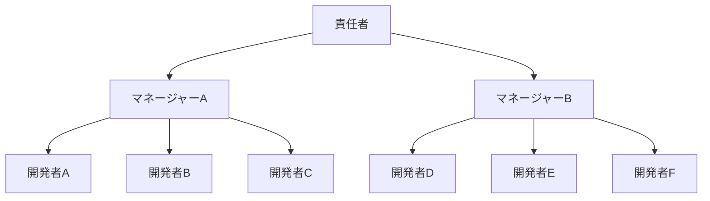
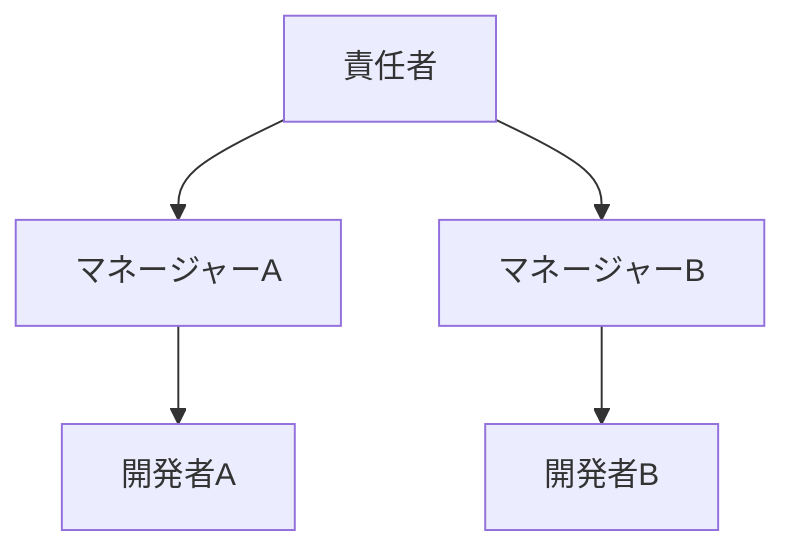
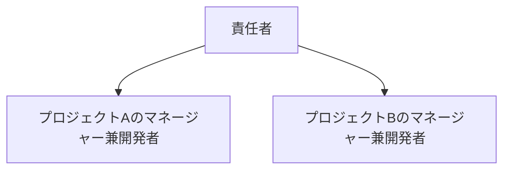
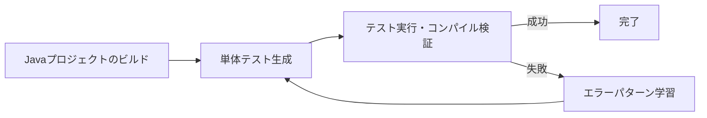

##

最近、従来のソフトウェア開発はいよいよ終わりだなと思うことが増えてきました。場合によって、10年など長期のスパンで考えた場合はソフトウェア開発という仕事自体が最悪の場合は消滅し、良い場合でも大幅に縮小するだろうなと考えはじめています。

LLMと呼ばれるAI技術自体は一昨年から活用を始め、去年と今年は特に顕著に活用していることは既に書いています。日に日にAIを使用するコストは上がってきており、先月はは1ヶ月で$125もAIに使っていました。

参考:

ソフトウェア開発という文脈だけでも、去年からAIにコードを生成させることを取り入れ始めており、今年はツールを色々と変えていますが基本的にAIにコードを書かせています。
今年は個人のGitHubアカウント上で既に1200件ものコード更新に関与しており、自分で手を動かしてコードを書いた件数は100件未満で90%以上のコードはAIに更新させているはずです。

コードを自分で書くということはもはや過去のことになり、最近はAIと対話しコードを生成させて成果物の品質をレビューしフィードバックすることがメインの作業になっています。

そんな中でふと思うことがあります。「自分の仕事は価値があるものなのか」と。

AI活用以前の従来のソフトウェア開発ではプログラミング言語やライブラリ固有の知識が重要でした。例えば、「JavaScriptのDate型は色々と問題があるからdate-fnsなどのライブラリを使った方がいいよね」といった感じです。

ただ、AIを使うようになり、知識が必要であるという前提が崩れつつあるのを感じます。現時点のAIは完璧ではないもののコードの書き方を知っており、In-context learning によりプロジェクト固有の情報やライブラリ固有の情報を学習させることができます。

つまり、従来であれば知識が必要だった知的作業が今は最小限の知識でもある程度は行えるようになっているのです。

## 今のAI技術は完璧ではない

まず、これを述べておかないといけないのですが、今のAI技術は完璧でなければ万能でもありません。

AIの生成したコードは動作しないこともあります。冗長で余計なコードを生成し、プロジェクトを無茶苦茶なカオスに陥れることもあります（経験談）。
なんならAIにより生成された無茶苦茶なコードを修正するためにプロの開発者を雇うためのサービス（vibecodefixers.com）まで存在する始末です。

現時点でAIを上手く活用するには暗黙知などの文脈情報や作業に必要な情報をAIに上手く共有してあげる必要があり、AIを活用する上でのコツを理解するかしないかでAIによる生成物の品質が大きく変わってきます。このあたりの難しさがAIに対する評価を分けている原因だと個人的に思っています。加えて、現時点だとAIを活用するためのツールをそもそも知らない人が多いという印象です。

ただ、これらの問題はの原因はAIが過渡期のものであるためであることを理解する必要があります。

AIの活用は始まったばかりで、使い方やツールも日進月歩で進歩している段階です。実際に、私が今年の前半に使っていたツールの大半は現時点では別のツールに置き換わっていますし、現在進行形で新しい活用方法を試している最中でもあります。活用方法も新しい論文やらツールが月毎に更新され、

重要なのは、このAI活用の進歩は今後も続くだろうということです。

## AIにより縮小する従来のソフトウェア開発

これは今年の段階から体感として感じる変化ですが、AI技術の進展により生産性が向上し、従来であれば3人必要だった案件が1人でも十分に回るようになったと感じます。

つまり、AIにより省人化が可能になりつつあるということです。

IT業界で働き始めて9年近くになりますが、従来のソフトウェア開発組織は概ね次のような形態だと思います。

プロジェクトマネージャーがいて、開発タスクをそれぞれの開発者にアサイン

今年の時点で既に以下のように人を減らせるレベルでの省人化は可能なレベルに到達できていると思っています。（ただし、日本の場合は慣例重視でリスクを嫌うため実際に省人化が行われたというより手持ち無沙汰の人が増えただけのように感じました。）

私が今考えているのは、将来的には

もちろん今すぐにこの規模の省人化は無理ですし、プロジェクトの規模によっては別の形になることもあるでしょう。
ただ、IT業界では末端から省人化が可能になりつつあるというのは現実だと思っています。

特に、現在の日本で流行っているデジタル化（DX）促進のためのITコンサルタントや開発業務（まさに私が属している業界）は今後どんどん価値を下げていくように思えます。
これは大規模なSIerであろうと少数精鋭のITコンサルタントであろうと変わらないと思っています。AIが代替で作業できる分野が拡大するにつれて、今まで大きかったパイは将来的には縮小することになると思います。
今はAI特需で需要が伸びている分野であっても長期的にはAIがその分野を担えるようになるでしょう。

## AIを使ってAIにより単体テストや仕様書を生成させる試み

AIによる省人化は実際にどこまで可能なのでしょうか。
既にAIを日常的に使っている人は、AI活用だけで数倍の生産性を出せることを体感として知っていると思います。
ただ、それ以上の生産性は出せるのでしょうか。

ここ数ヶ月の間、とある大企業の案件でソフトウェア開発にAIを活用するための試験的なプロジェクトに関わっていました。
詳細は述べませんが、メインとなるプロジェクトのJavaコードは数GBにも達する規模にも関わらず単体テストなどの整備は追いついていないようなプロジェクトで、AIにより単体テストを大規模に生成するというのを試すのが私のタスクでした。

生成が必要になる単体テストのファイル総数は数万ファイルにも及び、1ファイルずつAIに生成の指示を出したとしても半年以上はかかる見積もりでした。

そのような中で、私はLangGraphによる単体テスト生成のワークフローの作成という方法を用いました。
以下のようなワークフローを実行し、人間が寝ている間や休んでいる間でもAIに全自動で単体テストを生成させるというアプローチです。

結果を言うと、単体テストの網羅率に若干の課題は残るものの、動作する単体テストを全自動でAIに生成させることは実現できました。

## デジタル空間での人間に残されたもの

AIによりデータ分析やコーディング・資料作成などありとあらゆる知的労働の生産性がとてつもないほど上がっている一方で、今まで価値があるとされてきたそれらデジタル空間での知的労働は今後価値を減らしていくことは確実だと思います。

AIによるホワイトカラー職種の省人化は既にアメリカでは始まっていますが、今後日本にも波及してくると思います。そうなった際にどうやって生きていくのかは考えていくべきです。

大学時代にギデンズの「再帰的近代」論を習いました。近代化による技術の発展や合理的な考えの普及により、それまで大事にされてきた伝統的な考えが意味をなさなくなり、社会自体が変化していくというような考えです。
今まさに、AIという技術の発展でIT技術への関わり自体を再帰的に考え直す時が来ていると考えています。

最近になって、デジタル空間での技術の指数関数的な発達の行き着く先で人間に残されるものは、最終的に「何かをしたいという意志」しかないのではないかと思うことがあります。
つまり、最終的にデジタル空間に残る価値は「便利なサービスを提供したい」や「社会課題を解決したい」という意志（指導者）だけで、それを実現するためだけの存在（作業者）は不要になるのではないかということです。

そのようにIT空間との関わりや自身のキャリアについて再帰的に考える中で、一つの選択肢として私は「起業」を検討しています。
今後の「意志」を推進する以外の価値が減少する中で、自らの「意志」を作り出せるのは起業が一番早いからです。
幸いにして、デジタル空間で「意志」を実現するためのコストはAIにより以前よりは小さくなっています。

率直に言って、今後の世の中がどうなるのかは明確には分かりません。明確に未来のことを分かっている人なんていないと思っています。
ただ、AIにより変わりつつある社会において、再帰的に考えることが重要なのではないでしょうか。
