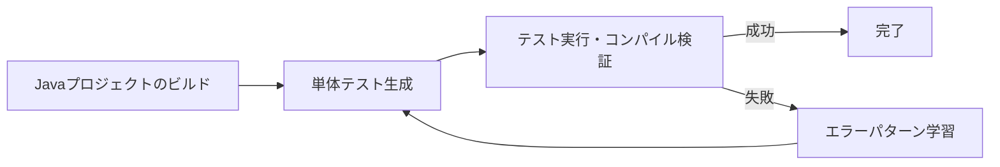
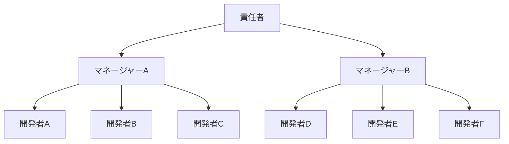
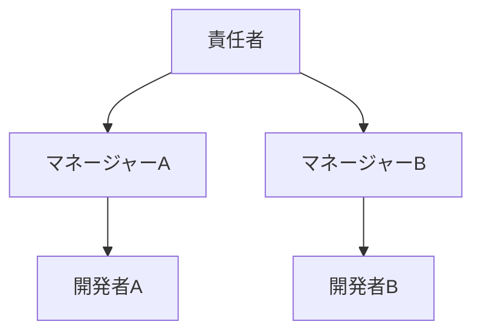
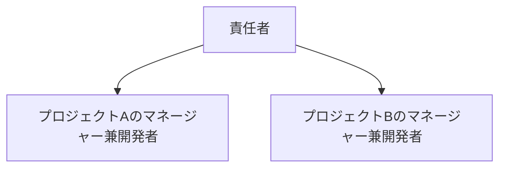

## はじめに

IT業界で働き始めて9年近くになります。
最近、従来のソフトウェア開発はいよいよ終わりだなと思うことが増えてきました。

幼い頃からPCに触れてきた影響でIT業界で働きはじめ、幼い頃から色々な技術の進化を見てきました。ただ、今回の進化は従来の技術進歩とは質的に異なる、産業構造自体を変革するレベルの進化だと考えています
AIによりソフトウェア開発の生産性が劇的に向上しただけで終わる話ではなく、従来の開発手法やソフトウェア開発者の価値そのものを大きく考え直す必要があると考えています。

AIの活用がまだ普及しはじめたばかりの去年や一昨年からすると、今年はAIを使う人も増えた印象もあります。「AIによる失業」という過激な発言も大手メディアでも取り扱うようになった影響で去年よりは受け入れられやすくなった気がします。

既にアメリカでは「AIによる失業」が現実のものになりつつあります。
日本においても例外ではなく、10年など長期のスパンで考えた場合、いわゆるホワイトカラー系の職種が大幅に縮小することは確実だと考えています。

実際に、セントルイス連邦準備銀行の2025年8月の研究によると、AI露出度の高い職種（特にコンピューター・数学系）で失業率の有意な増加が確認されています。また、ゴールドマン・サックスは2025年8月のレポートで、AIが6-7%の米国労働力を置き換える可能性があると推定しています。[^1]

今日はそのような「AIによる社会への変化」ということへの私見を述べていきたいと思います。

## ソフトウェア開発業を考え直す時が来た

私自身、LLM（Large Language Model）と呼ばれるAI技術自体は一昨年から活用を始め、去年と今年は特に顕著に活用しています。私の中では、日に日にAIを使用するコストは上がってきており、先月は1ヶ月で$125もAIに使っていました。

ソフトウェア開発という文脈だけでも、去年からAIにコードを生成させることを取り入れ始めており、今年はツールを色々と変えていますが基本的にAIにコードを書かせています。
今年は個人のGitHubアカウント上で既に1200件ものコード更新に関与しており、自分で手を動かしてコードを書いた件数は100件未満で90%以上のコードはAIに更新させているはずです。

自分の中では、既にコードを自分で書くということはもはや過去のことになり、最近はAIと対話しコードを生成させて成果物の品質をレビューしフィードバックすることがメインの作業になっています。

AI活用以前の従来のソフトウェア開発ではプログラミング言語やライブラリ固有の知識が重要でした。例えば、「JavaScriptのDate型は色々と問題があるからdate-fnsなどのライブラリを使った方がいいよね」といった感じです。

ただ、AIを使うようになり、知識が必要であるという前提が崩れつつあるのを感じます。現時点のAIは完璧ではないもののコードの書き方を知っており、In-context learning（文脈内学習：AIに例示やプロジェクトの情報を与えることで、その場で新しいタスクを学習させる技術）によりプロジェクト固有の情報やライブラリ固有の情報を学習させることができます。

つまり、従来であれば知識が必要だった知的作業が今は最小限の知識でもある程度は行えるようになっているのです。

### AIの限界と可能性

これを述べておかないといけないのですが、今のAI技術は完璧でなければ万能でもありません。

AIの生成したコードは動作しないこともあります。冗長で余計なコードを生成し、プロジェクトを混沌とした状態に陥れることもあります（経験談）。
さらには、AIにより生成された問題のあるコードを修正するためのサービスまで存在する始末です。

VibeCodeFixers.comは実在するサービスで、AIを活用した「Vibe Coding」により生成された問題のあるコードの修正を専門とするサービスです。創設者のSwatantra Sohniによると、既に300人を超えるベテラン開発者が登録し、これまでに30-40のプロジェクトをマッチングしているようです。[^2]

ただ、これらの問題の原因はAIが過渡期のものであるためであることを理解する必要があります。

現時点でAIを上手く活用するには暗黙知や作業に必要な文脈情報（コンテキスト）をAIに上手く共有してあげる必要があり、AIを活用するコツを理解するかしないかでAIによる生成物の品質が大きく変わってきます。このあたりの難しさがAIに対する評価を分けている原因だと個人的に思っています。

加えて、現時点だとAIを活用するためのツールをそもそも十分に知らない人が多いという印象です。例えば、無償で使えるGitHub CopilotのVSCodeプラグインなど一部のツールは、AIモデルを開発している会社が提供している有償ツールに比べて十分に最適化されておらず、それらのツールしか知らない人がAIに対して文句を言っていても納得できてしまいます。

AIの活用は始まったばかりで、使い方やツールも日進月歩で進歩している段階です。
実際に、私が今年の前半に使っていたツール（Cursorなど）は現時点では別のツール（Claude Code：ターミナルで動作するAIコーディングアシスタント、やCodex CLI：OpenAI製の同種ツール）に置き換わっていますし、現在進行形で新しい活用方法を試している最中でもあります。

現在の限界は技術発展の過程において一時的なものであり、技術の成熟とツールの改善により解決される可能性が高いということです。
重要なのは、このAI活用の進歩は今後も続くだろうということです。

## 大規模プロジェクトでのAI活用実例

AIによる省人化は実際にどこまで可能なのでしょうか。
既にAIを日常的に使っている人は、AI活用だけで数倍の生産性を出せることを体感として知っていると思います。
ソフトウェア開発という分野では、GitHub Copilot（マイクロソフト製のAIコード補完ツール）、Cursor（AI統合型コードエディター）、Claude Code（ターミナルで動作するAIコーディングアシスタント）、Codex CLI（OpenAI製の同種ツール）など様々なツールが流行っているので、これらの対話型のツールで業務を効率化できている人は多いと思います。
ただ、それ以上の生産性は出せるのでしょうか。

ここ数ヶ月の間、とある大企業の案件でソフトウェア開発にAIを活用するための試験的なプロジェクトに関わっていました。
詳細は述べませんが、プロジェクトのコードは数GBにも達する規模で、コードをコンパイルするだけでかなりの時間が必要になる規模のプロジェクトでした。

ソフトウェア開発の工程では、コードが実際に動作することを保証するために単体テストというテストコードを書くことが一般的です。
数GBの大規模プロジェクトなら少しのコードの変更で思わぬ副作用が出ることもあるので単体テストを書くことはほぼ必須にも関わらず、単体テストの整備は追いついていないようなプロジェクトでした。
そのようなプロジェクトで、AIにより単体テストを大規模に生成するというのを試すのが私のタスクでした。

生成が必要になる単体テストのファイル総数は数万ファイルにも及びました。
人間が作業した場合の見積もりをしたところ、1ファイル当たり30分以内で作業しても1年以上。AIによる補助ありで10分以内で作業しても半年以上はかかる見積もりでした。
つまり、一括で全自動でAIにコード生成をしてもらう必要がありそうということです。

そのような中で、私はLangGraph（AIワークフロー構築フレームワーク）による単体テスト生成のワークフローの作成という方法を用いました。
LangGraphは、簡単に言えばAIに複数のステップからなる作業を自動実行させるためのツールです。例えば、ワークフローの中でAIによる生成物の品質をチェックし、品質に問題があればAIに再生成させるというようなことを簡単に可能にすることができます。
今回の例では実際に動作する単体テストをAI生成させるワークフローを作成し、人間が寝ている間や休んでいる間でもAIに全自動で単体テストを生成させるというアプローチを採用しました。
以下の図は、AIによる自動テスト生成の流れを示したものです。

結果を言うと、単体テストの網羅率に若干の課題は残るものの、動作する単体テストを全自動でAIに生成させることは実現できました。
arXiv.org（研究者が論文を公開する学術プラットフォーム）の文献を参考に色々と試行錯誤したのですが、詳細は割愛します。

重要なのは、現在一般的に普及し始めているAIの活用方法は未だに表面的なものに過ぎず、普及していない活用方法・研究が進んでいない活用方法は山のようにあるということです。
AI活用は今後も研究が進み、より優れた方法がまだまだ出てくる可能性が高いということです。

## 組織構造の変化と省人化の実態

これは今年の段階から体感として感じる変化ですが、AI技術の進展により生産性が向上し、従来であれば例えば3人必要だったプロジェクトが1人でも十分に回るようになったと感じます。
さらには3人に対してプロジェクトの情報や進捗を共有するよりAIに管理させた方が早いし楽だとすら思います。

つまり、AIにより省人化が可能になりつつあるということです。

従来のソフトウェア開発組織は概ね次のような形態だと思います。

プロジェクトマネージャーがいて、開発タスクをそれぞれの開発者にアサインする形式です。

来年には以下のようになっていてもおかしくないと考えています。

正直な話、今年の時点で既に3人分のタスクを担当させるレベルでの省人化は可能なレベルにAIの性能は到達できていると思っています。
（ただし、日本の場合は慣例重視でリスクを避ける傾向のため、実際に省人化が行われたというより手持ち無沙汰の人が増えただけのように感じました。）

将来的には以下のような形まで省人化が進む可能性があると考えています。

このレベルまで省人化が進んだ場合、開発者は「単なる作業者」ではなく「ビジネスを考える当事者」になる必要があるでしょうし、今とは違ったスキルを求められるのは明確です。

もちろん今すぐにこの規模の省人化は無理ですし、俗人化を避けるなどの理由で別の形になることもあるでしょう。
ただ、AIによりIT業界では末端から省人化が可能になりつつあるというのは事実だと思っています。

その一方で、現在の日本で流行っているデジタル化促進のためのIT専門職（まさに私が属している業界）の需要はしばらく残る気がしています。
特に今はAI活用を始めたい企業も多いでしょうし、AIによってITやデジタル化自体の需要がなくなるわけでもないからです。

ただ、需要はあっても省人化は可能です。
今まで大きかったパイは大きいままかもしれませんが、少数により効率的に独占されるような未来が来ても不思議ではないと思います。
これまでは人数が必要だった分野であっても、わざわざ外部の人間を入れる理由は日に日に薄くなると思います。

## ソフトウェア開発者に残される価値とは

AIによりデータ分析やコーディング・資料作成などありとあらゆる知的労働の生産性がとてつもないほど上がっている一方で、デジタル空間での省人化はこれから日に日に進んでくると思います。
AIによるホワイトカラー職種の省人化は既にアメリカでは始まっていますが、日本にも波及してくると思います。
最近、以前お世話になったIT業界のリクルーターと話す機会がありましたが、まだAI活用が十分進んでいない日本でも2年後には変わっていると思うというお話をされていました。

大学時代にギデンズの「再帰的近代」論を習いました。これは、近代化による技術の発展や合理的な考えの普及により、それまで大事にされてきた伝統的な考えが意味をなさなくなり、社会自体が自らを見直し変化していくという社会学理論です。[^3]
今まさに、AIという技術の発展でIT技術への関わり自体を再帰的に考え直す時が来ていると考えています。

最近になって思うのは、デジタル空間での指数関数的な技術発達の行き着く先で人間に残されるものは「何かを実現したいという意志」しかないということです。
現在のAIはまだ「意志」を持っていません。人間による指示や命令が彼らには必要になります。
つまり、最終的にデジタル空間に残る価値は「便利なサービスを提供したい」や「社会課題を解決したい」という意志だけで、それを実現するためだけの存在・作業者は不要になるのではないかということです。

## 起業という選択肢

そのようにITとの関わりや自身のキャリアについて再帰的に考える中で、一つの選択肢として私は「起業」を検討しています。
自らの「意志」を生み出すには起業が一番早いからです。
幸いにして、デジタル空間ではAIによるサポートにより、未知の分野であっても以前よりは何かを実現するためのコストが小さくなっています。

そうなった際にどうやって生きていくのかは考えていくべきです。率直に言って、今後の世の中がどうなるのかは明確には分かりません。明確に未来のことを分かっている人なんていないと思っています。
ただ、AIにより変わりつつある社会において、再帰的に考えることが重要な気がしています。

---

[^1]: [セントルイス連邦準備銀行（2025年8月）"Is AI Contributing to Rising Unemployment? Evidence from Occupational Variation"](https://www.stlouisfed.org/on-the-economy/2025/aug/is-ai-contributing-unemployment-evidence-occupational-variation)、[ゴールドマン・サックス（2025年8月）"How Will AI Affect the Global Workforce?"](https://www.goldmansachs.com/insights/articles/how-will-ai-affect-the-global-workforce)

[^2]: [404 Media（2025年9月）"The Software Engineers Paid to Fix Vibe Coded Messes"](https://www.404media.co/the-software-engineers-paid-to-fix-vibe-coded-messes/)、[Futurism（2025年9月）"Amateurs Using AI to 'Vibe Code' Are Now Begging Real Programmers to Fix Their Botched Software"](https://futurism.com/vibe-code-real-programmers-fix-software)

[^3]: アンソニー・ギデンズ『近代とはいかなる時代か？』（1993年）における「再帰的近代化」理論
