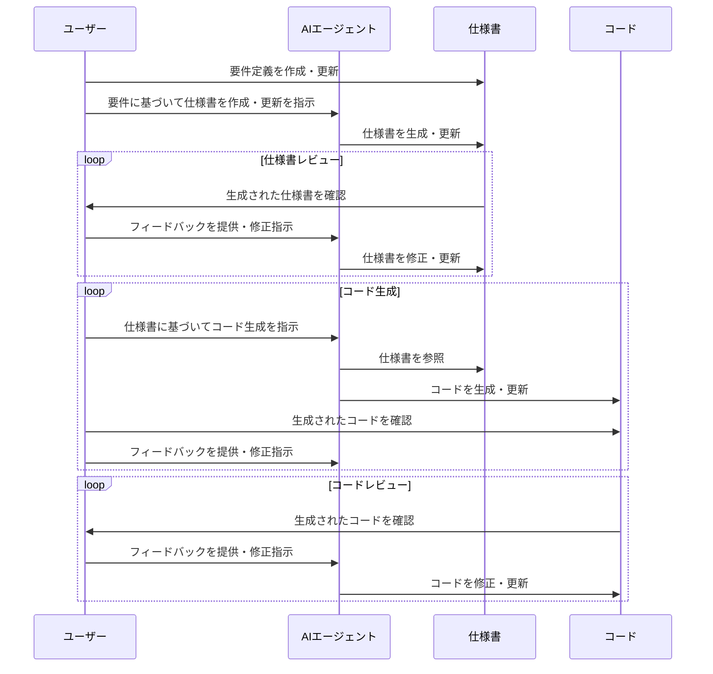

## はじめに

気がつけば2025年も終わりに近づいています。

今年はAIエージェントが急速に発展し、ソフトウェア開発におけるAI駆動開発の手法も大きく進化しました。前回似たような記事を書いたのは2025年5月でしたが、その後の数ヶ月で状況は大きく変わりました。

特に大きく変わったタイミングはClaude Codeの登場です。AIエージェントで全てが完結するようになり、ソフトウェア開発で実際にコードを書くということがほぼ不要になりつつあります。

ただ、それに伴い、AI駆動開発における新たな課題も浮上しているというのが現状だと思います。解決方法については色々な分野で試行錯誤されている段階ですが、私なりのメモとして、2025年12月時点におけるAI駆動開発の活用方法と課題について残しておこうと思います。

## 私の現状

去年から実際にコードを書くという行為をAIに依存することが増えていたのですが、私の使用ツールの遷移と現状をまとめておくことにします。

まず、2025年1月時点。まだ開発者向けのツールは限定的で、MCPもリリースされたばかりでした。この時点ではCursorをメインに使い、Cursorが制限を超えた場合にはClaude Desktop + [Filesystem MCP](https://github.com/modelcontextprotocol/servers/tree/main/src/filesystem) を使っていました。GitHub Copilotも使っていましたが、性能的にもUX的にも使いたいとは思えず、補助的に使う程度でした。Devin AIなどの他のAIによる開発ツールも試しましたが、結局Cursorをメインに使い続けていました。

その後、5月にClaude Codeがリリースされ、大きく状況が変わりました。IDEを使わずとも、AIエージェントが開発作業を完結できるようになったためです。2025年7月にはCursorとの契約を解消し、Claude Codeのために月額100ドルをAnthropicに支払うようになりました。（あと、Cursorは頻繁にトークン制限に引っかかっていたのも契約を解消した理由の1つです）

8月にGPT-5がリリースされ、Codex CLIと組み合わせて使い始めました。性能の進化に感動し、GPT-5 + Codex CLIの組み合わせもしばらく使っていました。あとは、Gemini 3 Proのリリースに伴い、Gemini CLIの使用頻度も増えました。どちらもAIモデルとしては非常に優秀で、コモディティ化が進んでいることを実感しました。

しかし、最終的には現状はClaude Codeに落ち着いています。Claude Codeは安定しており、[サブエージェント](https://code.claude.com/docs/ja/sub-agents)や[フック機能](https://code.claude.com/docs/ja/hooks-guide)などのエコシステムが充実しているので、他のツールに乗り換える大きな動機が現時点では見当たらないためです。

## AI駆動開発の課題

### コンテキストの喪失

基本的にAIエージェントは短期的なコンテキストに基づいて動作します。そのため、長期的なプロジェクトの全体像や設計意図を理解しないままコードを生成するということが起こり得ます。

実際に私が経験した例として、とあるWebアプリで認証を必要としない想定だったにも関わらず、AIエージェントが認証機能を実装してしまったというケースがあります。
AIエージェント側としてはセキュリティに考慮した結果として認証機能を追加したのだと思いますが、プロジェクト全体の設計意図を理解していなかったために不要な機能を実装してしまったのです。

### フランケンシュタイン・コードのリスク

また、「コンテキストの喪失」と似た問題として、フランケンシュタイン・コードのリスクも存在します。
複数のAIエージェントが生成したコードが組み合わさる際に、各エージェントが異なるスタイルやアーキテクチャを採用した場合、全体としての一貫性や品質が低下するという問題も起こり得ます。

例えば、Reactを使ったフロントエンド開発という分野においては、状態管理の方法が複数あることが知られています。Redux、Recoil、Context API、Zustandなどです。
AIエージェントがそれぞれ異なる方法を採用してコードを生成すると、コードベース全体の一貫性が失われ、保守が困難になります。

実際に、私の開発しているプロジェクトでも、AIエージェントが生成したコードの一部がReduxを使い、別の部分がContext APIを使っていたというケースがありました。

### 分からないことが分からない問題

この問題は、私のようなソフトウェアエンジニアよりも、むしろAIでコードを書き始めた非エンジニアのユーザーにとって問題になりやすいことですが、私自身も似たような経験をしています。
特に経験が浅い分野でAIエージェントに設計を任せる場合、AIエージェントが生成した設計が本当に最適なのかというのは判断が難しい場合が多々あると思います。

例えば、Reactを使ったフロントエンド開発という分野でも、「サーバーサイドレンダリングを使うべきか？」「静的サイト生成を使うべきか？」「クライアントサイドレンダリングを使うべきか？」という様々な選択肢があります。この中から最適な選択肢を選ぶためには、プロジェクトの要件を理解する必要がありますが、AIエージェントに全てを任せていると、最適な選択肢を見逃してしまうリスクがあります。

加えて、AIを使う人間自身に技術的な知識が不足している場合、AIエージェントが生成した設計の問題点に気づけない可能性があります。まさに「分からないことが分からない」状態です。

## 「仕様書駆動開発」

今年の夏頃から聞くことが増えた単語があります、「仕様書駆動開発」。
既に述べたように、AIエージェントに長期的なコンテキストを適切に提供することは難しい課題です。
それを解消するためにAI駆動開発を採用している開発チームでは「仕様書駆動開発」という手法が徐々に採用され始めていると理解しています。

私も今年の8月以降は「どうやってAIエージェントに長中期的なコンテキストを与えるか？」という点を試行錯誤し、時には全てをAIに任せてフランケンシュタイン・コードを生み出したこともありましたが、最終的には「仕様書駆動開発」という手法で安定感を得られるようになりました。

GitHubの[Spec Kit](https://github.com/github/spec-kit)や[Kiro](https://github.com/kirodotdev/Kiro)、日本だと[cc-sdd](https://github.com/gotalab/cc-sdd)などが有名なツールですが、ドキュメントとして仕様書を整備し、その仕様書に基づいてAIエージェントにコード生成を指示するという手法です。[PRP (Product Requirement prompts)](https://github.com/Wirasm/PRPs-agentic-eng)のような手法も似たような考え方だと思います。

私は色々と試した結果、[ai-coding-project-boilerplate](https://github.com/shinpr/ai-coding-project-boilerplate)をベースにした独自の仕様書テンプレートやエージェント、コマンドを使用しています。
詳細な部分はまだ試行錯誤の段階なので割愛しますが、基本的にはどのフレームワークも似たようなことをしていると思います。



ドキュメントとしてAIエージェントが参照できる長期的なコンテキストを明示的に提供することで、AIエージェントが長期的なコンテキストを喪失せずにコードを生成できるようになるというのが「仕様書駆動開発」の基本的な考え方ですね。

## 「仕様書駆動開発」を導入して感じたメリット

以下は個人的に感じている「仕様書駆動開発」のメリットです。

### AIだけでなく人間にとってもメリットがある

[今年の別の記事](/ja/blog/legacy-system-migration-lessons)でも述べたのですが、仕様書があるとないとでは人間にとって安心感が全然違います。
最悪の場合、AIエージェント向けにはコードを読んで仕様を理解させることも可能ですが、人間向けには開発の経緯や設計意図が理解できるドキュメントがあると非常に安心感があります。
変更していいのか分からない意図不明のコードと遭遇して開発のスピードが落ちるような馬鹿げた事態を避けることもできます。

また、チーム開発で新規メンバーが参加する際や、既存メンバーが長期間プロジェクトから離れていた場合でも、仕様書があればプロジェクトの全体像を把握しやすくなります。
時間を浪費することなく、スムーズに開発に参加してもらうことができます。

仕様書駆動開発のおかげでドキュメントの重要性が再確認できたと思います。
今までは、仕様書は開発が終わった段階やリリース直前に作成することが多かったのですが、仕様書駆動開発なら開発の初期段階から仕様書を作成・更新し続ける必要があるため、ドキュメント整備のモチベーションも自然と維持できます。

### バグが混入した際にコンテキストをAIに提供しやすい

ソフトウェア開発にバグはつきもので、AIエージェントに任せていても結構な頻度でバグが混入します。

ただ、「どこでバグが混入したのか？」や「どういう設計意図でそのコードが書かれたのか？」というのは、以前までだとAIエージェントに伝えるのが難しかったことでした。
コードの履歴をAIと辿って、「このコードはこういう意図で書かれたのですが、こういうバグが混入しています。本来の意図はこのようであり、修正してください」と伝えるのは結構大変です。

仕様書駆動開発の導入以前だと、AIエージェントにバグの修正を依頼した際に、バグの修正に伴い実装した機能が消失することすらありました。
ただ、仕様書駆動開発を採用している場合は、仕様書を参照することでAIエージェントにコンテキストを提供しやすくなります。

例えば、Claude Code + 仕様書駆動開発の組み合わせでバグ修正を依頼する場合、以下のように指示できます。

```sh
@docs/done/2025-12-15-refactor-map-reduce.md で実装された Map-Reduce 機能にバグがあります。具体的には、reduce 関数が正しく動作していません。仕様書の該当部分を参照し、バグを修正してください。設計ドキュメントや仕様書の意図に沿って、コード全体の整合性も保つように注意してください。
```

最近は、Claude Codeのコマンド機能だけでほぼ全ての開発作業を完結できるようになってきたので、さらに効率的にバグ修正を依頼できるようになっています。

```sh
/dev:fix-bug @docs/done/2025-12-15-refactor-map-reduce.md Map-Reduce 機能が動作しません。
```

### 状況を把握しやすい

AIエージェントがコードを開発する時代に突入しても、今は過渡期ということで、まだまだ日々のタスクやプロジェクトの進捗を共有する機会が多いと思います。
デイリーミーティングなら昨日のメモをパッと更新すれば済むのですが、月次ミーティングなどではプロジェクト全体の進捗を毎回書き出すのは大変です。

そんな時にも仕様書駆動開発は役に立ちます。
Claudeにパッと指示を与えるだけで、週次や月次の進捗レポートを生成してくれます。

```sh
12月3日から12月17日までのプロジェクトの進捗レポートを作成してください。
プロジェクト管理のための状況把握を目的としています。
`docs/done`フォルダ内で、該当期間内に実施されたタスクを参照し、各タスクの概要、完了状況を含めてください。
類似タスクはまとめて記載し、全体の進捗を把握しやすくしてください。
```

## 「仕様書駆動開発」の難しさ

ここからは逆に、「仕様書駆動開発」を導入して感じた難しさについて述べます。
デメリットというよりは、運用上の難しさですね。

### 設計フェーズの負荷増大

「仕様書駆動開発」では名前の通り、「仕様書」が最も重要な要素となります。
「仕様書」の品質が悪いと、AIエージェントが生成するコードだけでなく、プロジェクト全体の品質も低下します。

さらに、先に述べたように、仕様書を作成する上では「分からないことが分からない問題」も存在します。
つまり、AIエージェントに設計を任せる場合でも、AIエージェントが生成した設計が本当に最適なのかを判断するためには、ある程度の知識や検証が必要となります。

ドキュメント作成だけで1日を費やすことも珍しくなく、「仕様書駆動開発」の導入でプロジェクトの管理やプロジェクトの品質は向上したのですが、生産性は落ちたように感じています。
リグレッション（手戻り）が減っているのでであれば結果オーライなのですが、AIエージェント導入で人間の負荷が増えてしまっている点は課題だと感じており、もう少し効率化できる余地はあるのかなと思っています。

### 仕様書のメンテナンスコスト

これも設計フェーズの負荷増大と似た話ですが、仕様書を最新の状態に保つためのメンテナンスコストも無視できません。
仕様書が古くなってしまうと、AIエージェントが誤ったコンテキストに基づいてコードを生成してしまうリスクがあります。

加えて、ドキュメントの種類や形式も重要で、どこまでの内容を・どのような形式で仕様書に含めるべきかを考える必要もあります。
要件と実装内容だけの設計書でいいのか、Architecture Decision Record（ADR）のような形式も必要なのか、細かい部分まで仕様書に含めるべきなのかなど、色々と考えることは多いです。

ドキュメントを管理するための工数は必然的に増えているので、なんとか効率化できる方法を模索しています。
ちなみに、[Claude Codeではフック機能を使ってドキュメントのメンテナンスをある程度は自動化](https://zenn.dev/appbrew/articles/e2f38677f6a0ce)できます（全ては自動化できませんが…）。

## おわりに

2025年はAI活用が急速に進み、「AIでホワイトカラーの仕事が奪われる」という議論が盛んになり、自分も似たようなことを考える機会が増えました。
ただ、LLMの短期的なコンテキストに由来する課題やハルシネーションの問題などと日々向き合っていると、結局人間もある程度は関与し続ける必要があるかもなと感じています。

今年の秋ごろまでは、「AIに全てを任せてしまえば良いのでは？」と考えていましたが、現状ではAIエージェントに任せる部分と人間が関与する部分のバランスを取ることが重要なのかなと思うことが増えました。
具体的には、設計や要件定義はAIの補助を受けつつも人間が主導し、コード生成やテスト、ドキュメント作成などの反復的な作業はAIエージェントに任せるという形です。

結局のところ、過渡期なので将来のことは分からないのですが、今のところは日々の進歩を楽しみつつ、AI駆動開発の課題解決に取り組んでいきたいと思います。
