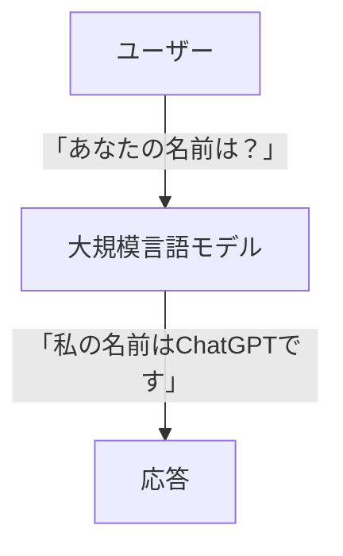
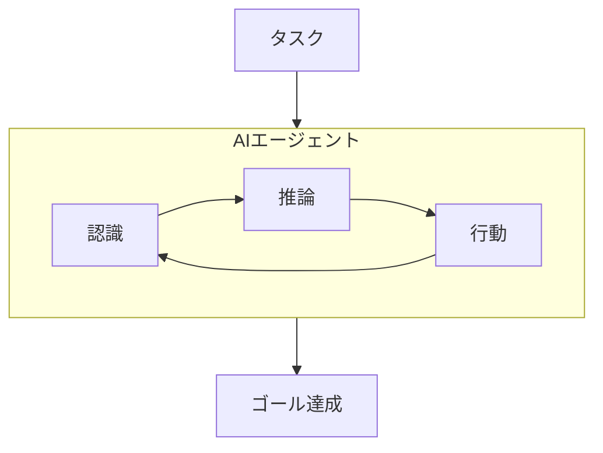
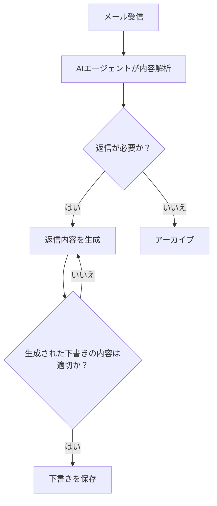
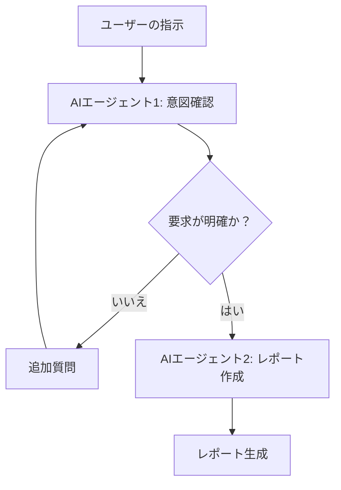

2026年、あけましておめでとうございます。

2025年は大規模言語モデル（LLM）の性能が飛躍的に向上し、AIエージェントが多くの分野で実用化され始めた年でした。
私の周囲でも今までAIを使ってこなかった層の人がAIを使い始めているのを多く見かけました。皆さんの職場や日常生活でも、AIが活用される機会が増えてきたのではないでしょうか。

ソフトウェアエンジニアとしての私の仕事内容も変わってきており、去年の労働時間の半分以上はAIエージェントの設計や実装、AIエージェントやAI エージェント・ワークフロー活用のPoC（概念実証）を行っていました。
そんな中で、年始の挨拶で「何をしているのですか？」と聞かれた際に困る場面が増えてきました。今までであれば「某社のシステムを開発している」とか「某社のアプリを作っている」と説明しておけば大抵の人には理解してもらえたのですが、「AI エージェント・ワークフローを設計しています」と説明しても簡単には理解してもらえません。

そこで今回は、AI エージェント・ワークフロー（AI Agent Workflow）とは何かについて、私の考えの整理も兼ねて説明したいと思います。

## 本記事での用語について

本題に入る前に、用語について簡単に整理しておきます。

AIエージェントを活用したワークフローを指す用語として、業界では複数の表現が使われています。

- **エージェンティック・ワークフロー（Agentic Workflow）**: 「Agentic（エージェント的な）」という形容詞を使った表現で、AIエージェントの自律性を活かしたワークフローを指します。Andrew Ng氏やAnthropicなど、AI研究者やAI企業がよく使用する用語です。
- **AI ワークフロー（AI Workflow）**: AIを活用したワークフロー全般を指しますが、事前に定義された固定的な手順に従うものも含むため、より広い概念です。
- **エージェント・ワークフロー（Agent Workflow）**: AIエージェントを組み込んだワークフローを指しますが、「AI」が省略されているため文脈によっては曖昧になる場合があります。

これらの用語は厳密には微妙なニュアンスの違いがありますが、実務上はほぼ同義で使われることが多いです。本記事では、「AIエージェントを活用した自律的なワークフロー」という意味で「**AI エージェント・ワークフロー（AI Agent Workflow）**」という表現で統一します。

## AI エージェントとは？

第一段階として、まずAIエージェントについて簡単に説明します。

昨今では、大規模言語モデル（LLM）とAIエージェントについて混同されがちですが、両者は異なる概念です。

大規模言語モデル（LLM）は、脳みそのように情報を処理するための「モデル」です。大量のテキストデータを学習し、与えられた入力に対して最も適切な出力を生成する能力を持っています。ビッグデータから統計的に次に来る言葉を選択しているに過ぎませんが、モデルの進化により人間と会話しているように感じられるほど自然な応答が可能になっています。
例えば、文章の続きを生成したり、質問に答えたりすることができます。



一方で、AI エージェントは、LLMを活用して特定のタスクを自律的に遂行する「システム」です。AIエージェントは、ユーザーからの指示を受け取り、その指示に基づいて目標認識、推論、情報収集、行動などの複雑な動作を行うことができます。

例えば、Claude Code などのコーディングエージェントは、ユーザーからの要件を受け取り、実装のベストプラクティスを調査し、コードを生成し、テストを実行し、必要に応じて修正を加えることができます。AIエージェントでは、単なる応答生成にとどまらず、タスクの完了までの一連のプロセスを管理します。



## AI エージェント・ワークフローとは？

次に、AI エージェント・ワークフローについて説明します。

デジタル化が進む社会で、AIを使わなくても定型的な業務というのは既に多くが自動化されています。例えば、メールの自動振り分けや、請求書の自動発行などは予めルールを設定しておけば自動化できます。

```mermaid
flowchart TD
    A[メール受信] --> B{件名に"請求書"が含まれるか？}
    B -- はい --> C[請求書フォルダに移動]
    B -- いいえ --> D[その他フォルダに移動]
```

このような定型的な業務の多くは、AIを使わなくても、従来のルールベースのシステムやRPA（Robotic Process Automation）などのワークフローを使って自動化できます。
その理由は、定型的な業務の多くは明確なルールや条件に基づいて処理できるからです。例えば、メールからの特定のキーワードの抽出や、決まったフォーマットのデータ処理などは、ルールベースで十分に対応可能です。
ソフトウェア開発の場合、テストやデプロイの自動化もCI/CDワークフローを使って決められた手順に従って自動化されています。

しかし、非定型的な業務や複雑な意思決定が必要な業務は、従来のルールベースの自動化では対応が難しい場合があります。ここでAIエージェントが登場します。AI エージェント・ワークフローとは、AIエージェントが人間の代わりに非定型的な業務を自動で遂行することを可能にする仕組みです。
例えば、AIエージェントが「メールの内容を解析し適切な返信内容を下書きに保存する」など、今までは機械的に対応できなかった業務を自動化できます。



今回は「メール対応」という例で説明しましたが、AI エージェント・ワークフローはデータ分析、レポート作成、カスタマーサポートなど、様々な分野で応用可能です。

## ちょっと待って、AI エージェントだけで十分じゃないの？

ここまで読んで「AIエージェントがいればワークフローなんて必要ないのでは？」と思った人もいるかもしれません。
確かに、「メール対応」のような単一のタスクであれば、AIエージェント単体で完結する場合もあります。

しかし、実際の業務では複数のタスクが連携して動作することが多く、単一のAIエージェントだけでは対応しきれない場合があります。
また、業務の中には大規模なデータセットを扱う必要がある場合も多く、AIエージェント単体では最大トークン数の制限などにより処理が困難な場合もあります。
様々なトリガー（メール受信、定期実行、手動起動など）に対応する必要がある場合もあります。

そのため、AIエージェント・ワークフローを使うことで、複数のAIエージェントや従来のシステムを組み合わせて、より複雑で柔軟な業務プロセスを自動化することが可能になります。

## 具体的に AI エージェント・ワークフローではどのような動作・制御が可能なのか？

まず、基本的に今までの定型的なワークフローで可能だった動作・制御は全てAIエージェント・ワークフローでも可能だと思ってもらって大丈夫です。
「メールの自動振り分け」のようにメール受信をトリガーにしてワークフローを動作することもできますし、定期的にデータを収集することも可能ですし、手動でワークフローを開始することも可能です。

制御に関しては色々なことが可能ですが、代表的な制御は次の通りです。

- **順次実行（Sequential）**: タスクを順番に実行します。例えば、データ収集、分析、レポート作成の各ステップを順に実行するなど。
- **条件分岐（Conditional）**: タスクの結果に基づいて異なるパスを選択します。例えば、分析結果が特定の閾値を超えた場合にのみアラートを送信するなど。
- **ループ（Loop）**: 特定の条件が満たされるまでタスクを繰り返します。例えば、データが完全に収集されるまで繰り返し収集を行うなど。
- **並列実行（Parallel）**: 複数のタスクを同時に実行します。例えば、複数のデータに対して同時に分析を行うなど。

これらの制御は、「特定の文字列を含んでいるか？」や「数値が閾値を超えているか？」のようにAIエージェントを使わずに制御することもできますし、「AIエージェントが生成した内容が適切かどうかを別のAIエージェントに評価させる」など、複数のAIエージェントを使って制御することも可能です。

人間による判断（Human-in-the-Loop）をワークフローに組み込むこともできます。例えば、決済など金銭的な決定が関わる場合に最終確認を人間が行うようにするなどです。

AIエージェントを使うので、AIエージェントが使えるツールやAPIがあればそれらをワークフローに組み込むことも可能です。Web検索をAIエージェントに行わせたり、外部のデータベースから情報を取得させたりすることもできます。
既にカスタマーサポートチャットボットとして導入している企業も少なくないかと思いますが、**RAG（Retrieval-Augmented Generation）**を使うことで外部の知識ベースやドキュメントを参照しながら情報を生成することも可能です。

従って、データと判断基準さえあれば、様々な分野に対応する柔軟で複雑なワークフローを構築することができます、技術的には。

## どうやってAI エージェント・ワークフローを作る？

AI エージェント・ワークフローを作る手段はいくつかあります。
昔からあるRPAツールの中にはAIエージェント・ワークフローをサポートし始めているものもありますし、AIエージェント・ワークフローに特化した新しいツールも登場しています。

代表的なツールとしては、次のようなものがあります。

- **LangGraph(LangChainエコシステム)**: オープンソースのAIエージェント・ワークフロー構築フレームワークで、Pythonでカスタムエージェントやワークフローを作成できます。
- **n8n**: ノーコード/ローコードのワークフロー自動化ツールで、AIエージェントを組み込んだワークフローを簡単に作成できます。
- **Zapier**: 元々はGmailやSlackなど多数のアプリを連携させるツールですが、AIエージェントを組み込んだワークフローも作成可能です。
- **Agent Development Kit (ADK) by Google**: Googleが提供するAIエージェント開発キットで、コードファーストのアプローチで柔軟な開発が可能です。Google Cloudとの連携が簡単に行えます。

ケースバイケースですが、簡単なワークフローであればn8nやZapierのようなツールを使うのが手軽でおすすめです。メール返信内容の自動作成などの簡単なタスクであればこれらのツールで十分対応可能です。
業務自動化の一環として複雑なワークフローやカスタムエージェントが必要な場合はLangGraphを使うことが多いです。
また、最近では後発のGoogle ADKに注目しています。LangGraphの場合にはモニタリングやデバッグを行うのにLangSmithを別途使う必要があるところを、ADKではモニタリングやデバッグ・評価などさまざまな機能がADKに組み込まれている点が魅力的です（まだ実際のプロダクションでADKを使ったことはないので未知数ではあります）。

## AI エージェント・ワークフローを設計・実装する際に注意していること

AI エージェント・ワークフローは実際に強力なツールですが、設計・実装する際にはいくつか注意すべき点があります。

去年からいくつかのプロジェクトでAIエージェント・ワークフローを設計・実装してきた経験から言えるのは、データ設計が非常に重要だということなのですが、順を追って説明します。

### トークン制限に考慮したデータ設計

LLMを使っていれば「この会話は長さの上限に到達しています」のようなエラーメッセージを見たことがある人も多いと思いますが、LLMには一度に処理できるデータ容量（トークン数）に制限があります。LLMの進化によりトークン制限は徐々に緩和されていますが、それでも非常に大きなデータセットを扱う場合には依然として制約となります。

2025年に働いていたプロジェクトでは「そこそこ大きいデータセット + AIエージェント」を扱うことが多かったので、LLMのトークン制限に悩まされることが多々ありました。
私が経験から学んだことは、AIエージェント・ワークフローを設計する際には、データの前処理や要約、分割などを行い、LLMが扱いやすい形にデータを整形することが本当に重要だということです。

一度の処理でLLMに大きなデータを渡すことはトークン制限に引っかかるだけでなく、処理時間の増加やハルシネーションのリスクも高まります。百害あって一利なしです。
したがって、設計段階からデータのサイズを考慮し、必要に応じてデータを分割や要約したりすることが重要です。

LangGraphでは[Map-Reduceパターン](https://langchain-ai.github.io/langgraph/how-tos/map-reduce/)を使って大きなデータセットを分割し、各部分を個別に処理してから結果を統合する方法が提案されているので、こうしたパターンを活用するのも良い方法です。
[TOON](https://github.com/toon-format/toon)のようなトークン消費量に配慮したデータフォーマットを使うのも有効です。

### アウトプット品質の安定性とハルシネーション対策

LLMが確率論的に次の単語を予測する仕組みである以上、アウトプットの品質は常に一定ではなく、同じ入力に対しても異なる応答が返ってくることがあります。
また、同様に、ハルシネーション（事実に反する情報を生成すること）を完全に防ぐことは難しいです。

そういう事情があるので、AIエージェント・ワークフローを設計する際には、アウトプットの品質を安定させるための工夫やハルシネーション対策を講じることが必要になります。
具体的には、構造化プロンプトを使って応答のフォーマットを指定したり、信頼できる情報源からのデータのみを使用したり、複数のAIエージェントで結果を比較・評価するなどの方法があります。

アウトプットの品質の安定化に関しては、評価プロセス(Evaluation)をワークフローに組み込むことも有効です。例えば、AIエージェントが生成した内容を別のAIエージェントに評価させ、基準を満たしていない場合は再生成を促すなどの方法です。
評価プロセスの組み込みは、[DeepEval](https://github.com/confident-ai/deepeval)のような評価フレームワークを活用するのも良いですし、[ADKのように評価機能が組み込まれているツール](https://google.github.io/adk-docs/evaluate/)を使うのも効果的です。
個人的にはまだまだ試行錯誤の段階ですが、GoogleのADKは単体テストのような形式で評価プロセスを実行できる点が良さそうに感じています。

ただ、個人的には、評価プロセスによるガードよりはAIエージェントが一度に扱うデータ量を減らすように設計する方がはるかに効果的だと感じています。大きなデータセットを扱うほどハルシネーションのリスクは高まります。

### ユーザーの意図の曖昧さへの対処

検索エンジンやレコメンドエンジンの分野では昔からある課題のようですが、ユーザーの入力が曖昧であったり、文脈依存であったりする場合、AIエージェントが正確に意図を理解するのが難しい場合があります。

特にRAG（Retrieval-Augmented Generation）を使って外部の知識ベースやドキュメントを参照する場合、ユーザーの意図を正確にAIエージェントに伝えることが重要になります。
例えば、「最近の売上データを分析してレポートを作成してほしい」という指示では、「どの期間」や「どの指標を重視するか」などの詳細が不明確であり、AIエージェントが生成したレポートがユーザーの期待に合わない可能性があります。

この問題の対処方法はいくつかあります。

ひとつは、単純にガイドラインやテンプレートを提供して、ユーザーがより具体的な指示を出せるようにする方法です。例えば、「売上データの分析レポートを作成する際には、以下の項目を含めてください：期間、主要指標、トレンド分析、推奨アクション」のようなテンプレートを用意しておくことです。ただ、これはユーザー依存の解決策なので万能ではありません。

もうひとつは、複数のAIエージェントにより、ユーザーの意図や要求が明確になるまで対話を繰り返す方法です。例えば、最初のAIエージェントがユーザーの指示を受け取り、ユーザーの要求が明確になるまで追加の質問を行い、ユーザーの要求がすべて明確になった段階で次のAIエージェントにより情報検索やレポート作成を行う方法です。



LLMの性質上、ユーザーの要求に100%正確に応えるのは難しいですが、こうした工夫をすることで、ユーザーの意図をより正確に把握し、期待に沿ったアウトプットを生成する可能性を高めることができます。

## まとめ

本記事では、AIエージェント・ワークフローについて説明しました。

- **LLMとAIエージェントの違い**: LLMは情報を処理する「モデル」であり、AIエージェントはLLMを活用してタスクを自律的に遂行する「システム」です。
- **AI エージェント・ワークフローの役割**: 非定型的な業務や複雑な意思決定が必要なタスクを自動化するための仕組みです。複数のAIエージェントや従来のシステムを組み合わせることで、柔軟な業務プロセスを構築できます。
- **構築ツール**: LangGraph、n8n、Zapier、Google ADKなど、目的や複雑さに応じて様々なツールを選択できます。
- **設計時の注意点**: トークン制限を考慮したデータ設計と、ハルシネーション対策が重要です。特に、AIエージェントが一度に扱うデータ量を減らすことが効果的です。

AIエージェント・ワークフローはまだ発展途上の分野であり、ツールやベストプラクティスも日々進化しています。この記事が、AIエージェント・ワークフローを理解し、活用するための一助となれば幸いです。
